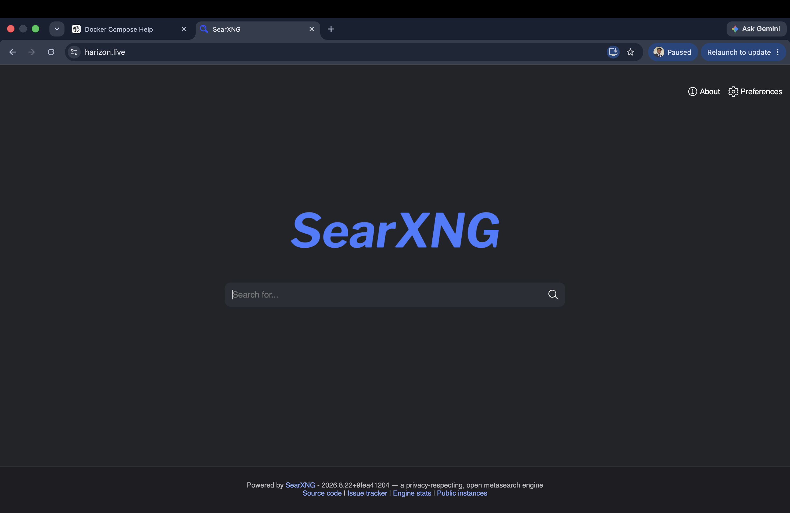

# Harizon

> A self-hosted, privacy-focused metasearch engine powered by SearXNG.

🌐 **Live Demo:** https://harizon.live

Harizon is a personal self-hosted search engine built using **SearXNG**, containerized with **Docker**, and exposed securely through **Caddy** with automatic HTTPS.

The project demonstrates how a modern web service can be deployed, secured, and managed on a Linux server using containers and reverse-proxy architecture.

---

## ✨ Features

- 🔎 Privacy-focused metasearch
- 🌐 Aggregates results from multiple search engines
- 🐳 Fully containerized using Docker
- 🔐 HTTPS enabled through Caddy
- ⚡ Lightweight and self-hosted
- 🔧 Configurable SearXNG instance
- 📦 Persistent Docker volumes for application data
- 🚀 Deployed on a Linux cloud server

---

## 🏗️ Architecture

```text
                         Internet
                            │
                            ▼
                    ┌─────────────────┐
                    │   harizon.live  │
                    └────────┬────────┘
                             │
                           HTTPS
                             │
                             ▼
                    ┌─────────────────┐
                    │      Caddy      │
                    │ Reverse Proxy   │
                    │ TLS / HTTPS     │
                    └────────┬────────┘
                             │
                             │ HTTP
                             ▼
                    ┌─────────────────┐
                    │     SearXNG     │
                    │      Core       │
                    └────────┬────────┘
                             │
                             │ Search Requests
                             ▼
                 ┌────────────────────────┐
                 │ External Search Engines│
                 │ / Search Providers     │
                 └────────────────────────┘

                    ┌─────────────────┐
                    │     Valkey      │
                    │ Cache / Runtime │
                    └─────────────────┘

```
Request Flow
1.A user visits https://harizon.live.
2.The request reaches the Caddy reverse proxy.
3.Caddy handles HTTPS/TLS and forwards the request to SearXNG.
4.SearXNG processes the search request.
5.SearXNG queries configured search engines/providers.
6.Results are aggregated and returned to the user.


---

## 🛠️ Technology Stack

| Technology | Purpose |
|---|---|
| SearXNG | Metasearch engine |
| Docker | Containerization |
| Docker Compose | Multi-container orchestration |
| Caddy | Reverse proxy and HTTPS |
| Valkey | Runtime/cache service |
| Ubuntu Linux | Server operating system |
| Git | Version control |
| GitHub | Source code hosting |
| Namecheap | Domain registration / DNS |


---

## 📁 Project Structure

```text
harizon/
│
├── Caddyfile
├── docker-compose.yml
├── .env.example
├── .gitignore
│
└── core-config/
    └── settings.example.yml


****Important Configuration Files****
-docker-compose.yml

***Defines the services required by Harizon:

-Caddy
-SearXNG
-Valkey
-Caddyfile

Configures Caddy as the reverse proxy and connects the public domain to the SearXNG service.

core-config/settings.example.yml

Provides a safe example of the SearXNG configuration.

The production configuration containing the actual secret is intentionally excluded from Git.


---

## 🐳 Docker Services

Harizon runs three main containers:

### Caddy

Responsible for:

- Reverse proxying
- HTTPS/TLS
- Receiving public traffic
- Forwarding requests to SearXNG

### SearXNG Core

The main application responsible for:

- Processing search requests
- Querying search providers
- Aggregating search results
- Serving the search interface

### Valkey

Used by SearXNG for runtime data and caching.


---

## 🚀 Running Locally

### Prerequisites

Install:

- Docker
- Docker Compose

Clone the repository:

```bash
git clone https://github.com/Haripolishetty/harizon.git
cd harizon


--Create the SearXNG configuration:

    cp core-config/settings.example.yml core-config/settings.yml

--Generate a strong secret key and replace the placeholder in:

    core-config/settings.yml

--Create your local .env configuration from .env.example if required.

--Then start the services:

    docker compose up -d

--Check the running containers:

    docker compose ps


---

## 🔐 Security

Production secrets are intentionally excluded from this repository.

The following files are ignored by Git:

```text
.env
core-config/settings.yml


**Security Principles
-Never commit passwords or API keys.
-Never commit private SSH keys.
-Keep production secrets outside version control.
-Use strong randomly generated secrets.
-Use HTTPS for public deployments.
-Keep infrastructure credentials private.


---

## 🌍 Deployment

Harizon is deployed on a Linux cloud server using Docker Compose.

The production architecture consists of:

```text
Domain
   ↓
Caddy
   ↓
SearXNG
   ↓
Search Providers


----The public service is available at:

    https://harizon.live


---

## 📊 Monitoring & Maintenance

Useful Docker commands for managing the deployment:

Check service status:

```bash
docker compose ps

--View application logs:

  docker compose logs

--Follow logs in real time:

  docker compose logs -f

--View container resource usage:

  docker stats


---

## 🎯 Project Goals

Harizon was created to explore and demonstrate:

- Self-hosted applications
- Linux server administration
- Docker containerization
- Reverse proxy architecture
- HTTPS/TLS configuration
- Domain and DNS configuration
- Git and GitHub workflows
- Secure configuration management
- Cloud deployment


---

## 🔮 Future Improvements

Possible future improvements include:

- Custom Harizon branding and UI
- Search analytics dashboard
- Health monitoring
- Automated deployments
- CI/CD pipeline
- Improved caching
- Additional search providers
- Infrastructure monitoring
- Automated backups


---

## 📸 Screenshots

### Harizon Homepage



### Search Results

.

---

## 👤 Author

**Hari Polishetty**

GitHub: https://github.com/Haripolishetty

---

⭐ If you find the project interesting, feel free to explore the repository.
